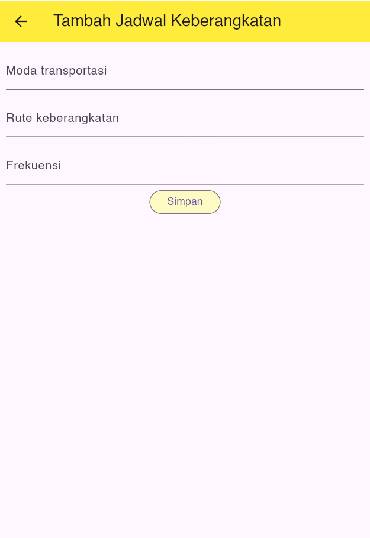

# Tugas Pertemuan 4
Nama       : Zia Khusnul Fauzi Akhmad

NIM        : H1D022023

Shift Baru : Shift D

## Proses Registrasi

### a. Mengisi Form Registrasi 
Pengguna baru dapat mendaftar dengan mengisi form registrasi yang berisi Nama, Email, Password, dan Konfirmasi Password


### Kode form registrasi : 
```dart
  Widget build(BuildContext context) {
    return Scaffold(
      appBar: AppBar(
        title: const Text('Register'),
      ),
      body: SingleChildScrollView(
        child: Padding(
          padding: const EdgeInsets.all(8),
          child: Form(
            key: _formKey,
            child: Column(
              mainAxisAlignment: MainAxisAlignment.center,
              children: [
                _namaTextField(),
                _emailTextField(),
                _passwordTextField(),
                _konfirmasiPasswordTextField(),
                _registerButton(),
              ],
            ),
          ),
        ),
      ),
    );
  }
```

Setelah registrasi berhasil, pengguna akan diarahkan ke halaman login. dan muncul pop up berhasil : 

### Kode Registrasi : 
```dart
void _submit() {
    _formKey.currentState!.save();
    setState(() {
      _isLoading = true;
    });
    RegistrasiBloc.registrasi(
      nama: _namaController.text,
      email: _emailController.text,
      password: _passwordController.text,
    ).then((value) {
      showDialog(
        context: context,
        barrierDismissible: false,
        builder: (BuildContext context) => SuccessDialog(
          description: "Registrasi berhasil, silahkan login",
          okClick: () {
            Navigator.pop(context);
          },
        ),
      );
    }, onError: (error) {
      print(error);
      showDialog(
        context: context,
        barrierDismissible: false,
        builder: (BuildContext context) => const WarningDialog(
          description: "Registrasi gagal, silahkan coba lagi",
        ),
      );
    });
  }
```

## Proses Login

### Menginputkan Username dan Password
Pada halaman login, pengguna diminta untuk memasukkan **username** dan **password**. Berikut adalah tampilan form login:


Form ini mengandung dua elemen penting: field untuk **username/email** dan **password**. Setelah pengguna memasukkan data, mereka dapat menekan tombol **Login** untuk memulai proses autentikasi.

Jika login berhasil, pengguna akan diarahkan ke halaman dashboard


**Kode untuk submit:**
```dart
Salin kode
void _submit() {
  _formKey.currentState!.save();
  setState(() {
    isLoading = true;
  });
  LoginBloc.login(
    email: _emailTextboxController.text,
    password: _passwordTextboxController.text,
  ).then((value) async {
    if (value.code == 200) {
      await UserInfo().setToken(value.token.toString());
      await UserInfo().setUserId((value.userId.toString()));
      showDialog(
        context: context,
        barrierDismissible: false,
        builder: (BuildContext context) => const SuccessDialog(
          description: "Login berhasil",
        ),
      ).then((value) {
        Navigator.pushReplacement(
          context,
          MaterialPageRoute(builder: (context) => const ProdukPage()),
        );
      }
      );
    } else {
      showDialog(
        context: context,
        barrierDismissible: false,
        builder: (BuildContext context) => const WarningDialog(
          description: "Login gagal, silahkan coba lagi",
        ),
      );
    }
  }, onError: (error) {
    print(error);
    showDialog(
      context: context,
      barrierDismissible: false,
      builder: (BuildContext context) => const WarningDialog(
        description: "Login gagal, silahkan coba lagi",
      ),
    );
  });
}
```
## Tampilan List Produk
Pada halaman Utama, pengguna dapat melihat daftar produk yang telah ditambahkan. Setiap item produk menampilkan informasi seperti Nama Produk dan Harga.


## Proses Tambah Data Produk
### a. Menampilkan Form Tambah Produk
Untuk menambahkan data produk, pengguna dapat membuka halaman Tambah Produk di mana mereka akan mengisi beberapa informasi penting seperti Nama Produk, Harga, dan Deskripsi.



### b. Request data ke API
Setelah mengisi form, pengguna dapat menekan tombol Tambah Produk untuk mengirimkan data produk ke API.

### Kode Submit Produk:
```dart
  void simpan() {
    setState(() {
      _isLoading = true;
    });
    Produk createProduk = Produk(id: null);
    createProduk.kodeProduk = _kodeProdukTextController.text;
    createProduk.namaProduk = _namaProdukTextController.text;
    createProduk.harga = int.parse(_hargaProdukTextController.text);
    ProdukBloc.addProduk(produk: createProduk).then((value) {
      Navigator.of(context).push(MaterialPageRoute(
          builder: (BuildContext context) => const ProdukPage()));
    }, onError: (error) {
      showDialog(
        context: context,
        builder: (BuildContext context) => const WarningDialog(
          description: "Simpan gagal, silahkan coba lagi",
        ),
      );
    });
    setState(() {
      _isLoading = false;
    });
  }
```

### Kode add product
```dart
  static Future<Produk> addProduk(
      {Produk? produk}) async {
    String url = ApiUrl.produk;
    var data = {
      "kode_produk": produk!.kodeProduk,
      "nama_produk": produk.namaProduk,
      "harga": produk.harga.toString(),
    };
    var response = await Api().post(url, data);
    var jsonObj = json.decode(response);
    return Produk.fromJson(jsonObj);
  }
```


## Proses Ubah Data Produk
### a. Menampilkan Form Edit Produk
Pengguna dapat memilih produk yang ingin diubah dengan menekan tombol Edit pada list produk, yang akan membawa mereka ke halaman Edit Produk.


### Kode untuk Form Edit Produk:

```dart
  void ubah() {
    setState(() {
      _isLoading = true;
    });
    Produk updateProduk = Produk(id: widget.produk!.id!);
    updateProduk.kodeProduk = _kodeProdukTextController.text;
    updateProduk.namaProduk = _namaProdukTextController.text;
    updateProduk.harga = int.parse(_hargaProdukTextController.text);
    ProdukBloc.updateProduk(produk: updateProduk).then((value) {
      Navigator.of(context).push(MaterialPageRoute(
        builder: (BuildContext context) => const ProdukPage(),
      ));
    }, onError: (error) {
      showDialog(
        context: context,
        builder: (BuildContext context) => const WarningDialog(
          description: "Permintaan ubah data gagal, silahkan coba lagi",
        ),
      );
    });
    setState(() {
      _isLoading = false;
    });
  }
```

## Proses Hapus Data Produk
### a. Menghapus Produk dari List
Pada halaman Detail Produk, pengguna dapat menghapus produk dengan menekan tombol Hapus pada detail item produk.
Kode untuk Hapus Produk:

```dart
void _deleteProduct(int id) {
  ProdukBloc.hapusProduk(id).then((_) {
    setState(() {
      // Memperbarui tampilan setelah penghapusan
    });
    showDialog(
      context: context,
      builder: (context) => AlertDialog(
        title: Text("Sukses"),
        content: Text("Produk berhasil dihapus."),
      ),
    );
  });
}
```